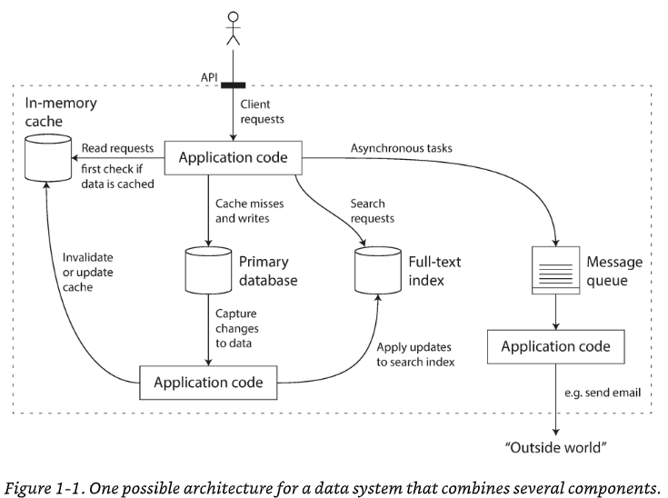

# Designing Data Intensive Applications

A short, focused technical note to kick off the documentation.

## Summary
A concise overview of a small utility: reading a file, transforming contents, and writing output.

## Chapters
- Preface
- Section I: Foundations of Data Systems
    - Chapter 1 - Reliable, Scalable & Maintainable Applications
    - Chapter 2 - Data Models & Query Languages
    - Chapter 3 - Storage & Retrieval
    - Chapter 4 - Encoding & Evolution
- Section II: Distributed Data
    - Chapter 5 - Replication 
    - Chapter 6 - Partitioning
    - Chapter 7 - Transactions
    - Chapter 8 - The Trouble with Distributed Systems
    - Chapter 9 - Consistency & Consensus
- Section III: Derived Data
    - Chapter 10 - Batch Processing
    - Chapter 11 - Stream Processing
    - Chapter 12 - The Future of Data Systems

## Section I: Foundations of Data Systems
#### Dicussing the fundamental ideas that underpin the design of data-intensive applications

### Preface

We call an application **data-intensive** if data is its primary challenge--the equantity of data, the complexity of data, or the speed at which it is changing--as opposed to __compute-intensive__, where CPU cycles are the bottleneck

New types of database systems ("NoSQL") have been getting lots of attention, but message queues, caches, search indexes, frameworks for batch and stream processing, and related technologies are very important too. Many applications use some combination of these

If any of the following are true for you, you'll find this book valuable:
- You want to learn how to make data systems scalable, for example, to support web or mobile apps with millions of users
- You need to make applications highly available (minimizing downtime) and operationally robust
- You are looking for ways of making systems easier to maintain in the long run, even as they grow and as requirements and technologies change
- You have a natural curiosity for the way things work and want to know what goes on inside major websites and online services. This book breaks down the internals of various databases and data processing systems, and it’s great fun to explore the bright thinking that went into their design.

There is truth in that statement: building for scale that you don’t need is wasted effort and may lock you into an inflexible design. In effect, it is a form of premature optimization. However, it’s also important to choose the right tool for the job, and different technologies each have their own strengths and weaknesses. As we shall see, relational databases are important but not the final word on dealing with data.

> [GitHub repo for all of the references linked in the book](https://github.com/ept/ddia-references)

### Chapter 1 - Reliable, Scalable & Maintainable Applications
#### Introduces the terminology and approach that we’re going to use throughout this book. It examines what we actually mean by words like reliability, scalability, and maintainability, and how we can try to achieve these goals.

A data-intensive application is typically built from standard building blocks that provide commonly needed functionality. 
For example, many applications need to:

1. Store data so that they, or another application, can find it again later (databases)
2. Remember the result of an expensive operation, to speed up reads (caches)
3. Allow users to search data by keyword or filter it in various ways (search indexes)
4. Send a message to another process, to be handled asynchronously (stream processing)
5. Periodically crunch a large amount of accumulated data (batch processing) 

When you combine several tools in order to provide a service, the service’s interface or application programming interface (API) usually hides those implementation details from clients. Now you have essentially created a new, special-purpose data system from smaller, general-purpose components. 

If you are designing a data system or service, a lot of tricky questions arise. How do you ensure that the data remains correct and complete, even when things go wrong internally? How do you provide consistently good performance to clients, even when parts of your system are degraded?

- Reliability: The system should continue to work correctly (performing the correct function at the desired level of performance) even in the face of adversity (hardware or software faults, and even human error). 
- Scalability: As the system grows (in data volume, traffic volume, or complexity), there should be reasonable ways of dealing with that growth. 
- Maintainability: Over time, many different people will work on the system (engineering and operations, both maintaining current behavior and adapting the system to new use cases), and they should all be able to work on it productively. 

_Reliability_

Typical expecations of a software application include: 
- The application performs the function that the user expected.
- It can tolerate the user making mistakes or using the software in unexpected ways.
- Its performance is good enough for the required use case, under the expected load and data volume. 
- The system prevents any unauthorized access and abuse. 

If all those things together mean “working correctly,” then we can understand reliability as meaning, roughly, “continuing to work correctly, even when things go wrong.” 

The things that can go wrong are called *faults*, and systems that anticipate faults and can cope with them are called *fault-tolerant* or resilient. 
> A fault is usually defined as one component of the system deviating from its spec, whereas a failure is when the system as a whole stops providing the required service to the user. It is impossible to reduce the probability of a fault to zero; therefore it is usually best to design fault-tolerance mechanisms that prevent faults from causing failures. 

*Hardware Faults*
When we think of causes of system failure, hardware faults quickly come to mind

Our first response is usually to add redundancy to the individual hardware components in order to reduce the failure rate of the system.

When one component dies, the redundant component can take its place while the broken component is replaced. This approach cannot completely prevent hardware problems from causing failures, but it is well understood and can often keep a machine running uninterrupted for years. Until recently, redundancy of hardware components was sufficient for most applications, since it makes total failure of a single machine fairly rare. As long as you can restore a backup onto a new machine fairly quickly, the downtime in case of failure is not catastrophic in most applications.

However, as data volumes and applications’ computing demands have increased, more applications have begun using larger numbers of machines, which proportionally increases the rate of hardware faults.

Hence there is a move toward systems that can tolerate the loss of entire machines, by using software fault-tolerance techniques in preference or in addition to hardware redundancy. Such systems also have operational advantages: a single-server system requires planned downtime if you need to reboot the machine (to apply operating system security patches, for example), whereas a system that can tolerate machine failure can be patched one node at a time, without downtime of the entire system.

*Software Errors*

Another class of fault is a systematic error within the system. Such faults are harder to anticipate, and because they are correlated across nodes, they tend to cause many more system failures than uncorrelated hardware faults [5]. Examples include: 
- A software bug that causes every instance of an application server to crash when given a particular bad input.
- A runaway process that uses up some shared resource—CPU time, memory, disk space, or network bandwidth. 
- A service that the system depends on that slows down, becomes unresponsive, or starts returning corrupted responses. 
- Cascading failures, where a small fault in one component triggers a fault in another component, which in turn triggers further faults. 

The bugs that cause these kinds of software faults often lie dormant for a long time until they are triggered by an unusual set of circumstances. In those circumstances, it is revealed that the software is making some kind of assumption about its environment—and while that assumption is usually true, it eventually stops being true for some reason. There is no quick solution to the problem of systematic faults in software. Lots of small things can help: carefully thinking about assumptions and interactions in the system; thorough testing; process isolation; allowing processes to crash and restart; measuring, monitoring and analyzing system behavior in production.

*Human Errors*

How do we make our systems reliable, in spite of unreliable humans? 
- Design systems in a way that minimizes opportunities for error. For example, well-designed abstractions, APIs, and admin interfaces make it easy to do “the right thing” and discourage “the wrong thing.” 
- Decouple the places where people make the most mistakes from the places where they can cause failures. In particular, provide fully featured non-production sandbox environments where people can explore and experiment safely, using real data, without affecting real users.
- Test thoroughly at all levels, from unit tests to whole-system integration tests and manual tests.
- Allow quick and easy recovery from human errors, to minimize the impact in case of failure. For example, make it fast to roll back configuration changes, roll out new code gradually.
- Set up detailed and clear monitoring, such as perfomance metrics and error rates. Monitoring can show us early warning signals and allow us to check whether any assumptions or constraints are being violated. When a problem occurs, metrics can be invaluable in diagnosing the issue. 

_Scalability_

One common reason for degradation is increased load: perhaps the system has grown from 10,000 concurrent users to 100,000 concurrent users, or from 1 million to 10 million.
 Perhaps it is processing much larger volumes of data than it did before. 
 
 *Scalability* is the term we use to describe a system’s ability to cope with increased load. 
 
 Note, however, that it is not a one-dimensional label that we can attach to a system: it is meaningless to say “X is scalable” or “Y doesn’t scale.” Rather, discussing scalability means considering questions like “If the system grows in a particular way, what are our options for coping with the growth?” and “How can we add computing resources to handle the additional load?”

*Describing Load*

Load can be described with a few numbers which we call load parameters. The best choice of parameters depends on the architecture of your system: it may be requests per second to a web server, the ratio of reads to writes in a database, the number of simultaneously active users in a chat room, the hit rate on a cache, or something else.

*Describing Performance*

In a batch processing system such as Hadoop, we usually care about throughput—the number of records we can process per second, or the total time it takes to run a job on a dataset of a certain size.iii In online systems, what’s usually more important is the service’s response time—that is, the time between a client sending a request and receiving a response.

> Latency and response time are often used synonymously, but they are not the same. The response time is what the client sees: besides the actual time to process the request (the service time), it includes network delays and queueing delays. Latency is the duration that a request is waiting to be handled—during which it is latent, awaiting service.

In practice, in a system handling a variety of requests, the response time can vary a lot. We therefore need to think of **response time** not as a single number, but as a _distribution of values that you can measure_.

It’s common to see the average response time of a service reported. (Strictly speaking, the term “average” doesn’t refer to any particular formula, but in practice it is usually understood as the arithmetic mean: given n values, add up all the values, and divide by n.)  Usually it is better to use percentiles. If you take your list of response times and sort it from fastest to slowest, then the median is the halfway point: for example, if your median response time is 200 ms, that means half your requests return in less than 200 ms, and half your requests take longer than that. This makes the median a good metric if you want to know how long users typically have to wait: half of user requests are served in less than the median response time, and the other half take longer than the median.

Amazon has also observed that a 100 ms increase in response time reduces sales by 1% [20], and others report that a 1-second slowdown reduces a customer satisfaction metric by 16%.

Queueing delays often account for a large part of the response time at high percentiles. As a server can only process a small number of things in parallel (limited, for example, by its number of CPU cores), it only takes a small number of slow requests to hold up the processing of subsequent requests—an effect sometimes known as head-of-line blocking. Even if those subsequent requests are fast to process on the server, the client will see a slow overall response time due to the time waiting for the prior request to complete. Due to this effect, it is important to measure response times on the client side.

*Approaches for Coping with Load*

Now that we have discussed the parameters for describing load and metrics for measuring performance, we can start discussing scalability in earnest: how do we maintain good performance even when our load parameters increase by some amount?

People often talk of a dichotomy between scaling up (vertical scaling, moving to a more powerful machine) and scaling out (horizontal scaling, distributing the load across multiple smaller machines). Distributing load across multiple machines is also known as a shared-nothing architecture.

Some systems are _elastic_, meaning that they can automatically add computing resources when they detect a load increase, whereas other systems are scaled manually (a human analyzes the capacity and decides to add more machines to the system). An elastic system can be useful if load is highly unpredictable, but manually scaled systems are simpler and may have fewer operational surprises.

_Maintainability_

### Chapter 2 - Data Models & Query Languages
#### Compares several different data models and query languages—the most visible distinguishing factor between databases from a developer’s point of view. We will see how different models are appropriate to different situations.

Data models are perhaps the most important part of developing software, because they have such a profound effect: not only on how the software is written, but also on how we think about the problem that we are solving. 

Most applications are built by layering one data model on top of another. For each layer, the key question is: how is it represented in terms of the next-lower layer?
1. As an application developer, you look at the real world (in which there are people, organizations, goods, actions, money flows, sensors, etc.) and model it in terms of objects or data structures, and APIs that manipulate those data structures. Those structures are often specific to your application.
2. When you want to store those data structures, you express them in terms of a general-purpose data model, such as JSON or XML documents, tables in a relational database, or a graph model.

each layer hides the complexity of the layers below it by providing a clean data model.

There are many different kinds of data models, and every data model embodies assumptions about how it is going to be used.
But since the data model has such a profound effect on what the software above it can and can’t do, it’s important to choose one that is appropriate to the application, which is why this chapter comapres the relational model, the document model, and a few graph-based data models.

_Relational Model Versus Document Model_

*Relational Model* 
The best-known data model today is probably that of SQL, based on the relational model proposed by Edgar Codd in 1970 [1]: data is organized into relations (called tables in SQL), where each relation is an unordered collection of tuples (rows in SQL).
The dominance of relational databases has lasted around 25‒30 years—an eternity in computing history.

Typically transaction processing (entering sales or banking transactions, airline reservations, stock-keeping in warehouses) and batch processing (customer invoicing, payroll, reporting).

*The Birth of NoSQL*

Now, in the 2010s, NoSQL is the latest attempt to overthrow the relational model’s dominance.

There are several driving forces behind the adoption of NoSQL databases, including:
- A need for greater scalability than relational databases can easily achieve, including very large datasets or very high write throughput
- A widespread preference for free and open source software over commercial database products 
- Specialized query operations that are not well supported by the relational model 
- Frustration with the restrictiveness of relational schemas, and a desire for a more dynamic and expressive data model

*The Object-Relational Mismatch*

Most application development today is done in object-oriented programming languages, which leads to a common criticism of the SQL data model: if data is stored in relational tables, an awkward translation layer is required between the objects in the application code and the database model of tables, rows, and columns. The disconnect between the models is sometimes called an impedance mismatch.

Object-relational mapping (ORM) frameworks like ActiveRecord and Hibernate reduce the amount of boilerplate code required for this translation layer, but they can’t completely hide the differences between the two models.

For a data structure like a résumé, which is mostly a self-contained document, a JSON representation can be quite appropriate. Some developers feel that the JSON model reduces the impedance mismatch between the application code and the storage layer. However, as we shall see in Chapter 4, there are also problems with JSON as a data encoding format. The lack of a schema is often cited as an advantage.
The JSON representation has better locality than the multi-table schema in Figure 2-1. If you want to fetch a profile in the relational example, you need to either perform multiple queries (query each table by user_id) or perform a messy multi-way join between the users table and its subordinate tables. In the JSON representation, all the relevant information is in one place, and one query is sufficient.

*Many-to-One and Many-to-Many Relationships*

The advantage of using an ID is that because it has no meaning to humans, it never needs to change: the ID can remain the same, even if the information it identifies changes. Anything that is meaningful to humans may need to change sometime in the future—and if that information is duplicated, all the redundant copies need to be updated.

Removing such duplication is the key idea behind _normalization_ in databases.

In relational databases, it’s normal to refer to rows in other tables by ID, because joins are easy. In document databases, joins are not needed for one-to-many tree structures, and support for joins is often weak. If the database itself does not support joins, you have to emulate a join in application code by making multiple queries to the database.
Moreover, even if the initial version of an application fits well in a join-free document model, data has a tendency of becoming more interconnected as features are added to applications.

*Are Document Databases Repeating History*

While many-to-many relationships and joins are routinely used in relational databases, document databases and NoSQL reopened the debate on how best to represent such relationships in a database. This debate is much older than NoSQL—in fact, it goes back to the very earliest computerized database systems.
The most popular database for business data processing in the 1970s was IBM’s Information Management System (IMS),

The design of IMS used a fairly simple data model called the hierarchical model, which has some remarkable similarities to the JSON model used by document databases [2]. It represented all data as a tree of records nested within records, much like the JSON structure of Figure 2-2.

Like document databases, IMS worked well for one-to-many relationships, but it made many-to-many relationships difficult, and it didn’t support joins. Developers had to decide whether to duplicate (denormalize) data or to manually resolve references from one record to another. These problems of the 1960s and ’70s were very much like the problems that developers are running into with document databases today.

*Comparison to Document Databases*

Document databases reverted back to the hierarchical model in one aspect: storing nested records (one-to-many relationships, like positions, education, and contact_info in Figure 2-1) within their parent record rather than in a separate table.

*Relational Versus Document Databases Today*

There are many differences to consider when comparing relational databases to document databases, including their fault-tolerance properties (see Chapter 5) and handling of concurrency (see Chapter 7). In this chapter, we will concentrate only on the differences in the data model.

The main arguments in favor of the document data model are schema flexibility, better performance due to locality, and that for some applications it is closer to the data structures used by the application. The relational model counters by providing better support for joins, and many-to-one and many-to-many relationships.

If the data in your application has a document-like structure (i.e., a tree of one-to-many relationships, where typically the entire tree is loaded at once), then it’s probably a good idea to use a document model. The relational technique of shredding—splitting a document-like structure into multiple tables (like positions, education, and contact_info in Figure 2-1)—can lead to cumbersome schemas and unnecessarily complicated application code.

The document model has limitations: for example, you cannot refer directly to a nested item within a document, but instead you need to say something like “the second item in the list of positions for user 251” (much like an access path in the hierarchical model). However, as long as documents are not too deeply nested, that is not usually a problem.

The poor support for joins in document databases may or may not be a problem, depending on the application. For example, many-to-many relationships may never be needed in an analytics application that uses a document database to record which events occurred at which time.

However, if your application does use many-to-many relationships, the document model becomes less appealing. It’s possible to reduce the need for joins by denormalizing, but then the application code needs to do additional work to keep the denormalized data consistent. Joins can be emulated in application code by making multiple requests to the database, but that also moves complexity into the application and is usually slower than a join performed by specialized code inside the database.

It’s not possible to say in general which data model leads to simpler application code; it depends on the kinds of relationships that exist between data items. For highly interconnected data, the document model is awkward, the relational model is acceptable, and graph models (see “Graph-Like Data Models”) are the most natural.

*Schema Flexibility*

Most document databases, and the JSON support in relational databases, do not enforce any schema on the data in documents. XML support in relational databases usually comes with optional schema validation. No schema means that arbitrary keys and values can be added to a document, and when reading, clients have no guarantees as to what fields the documents may contain.

A more accurate term is schema-on-read (the structure of the data is implicit, and only interpreted when the data is read), in contrast with schema-on-write (the traditional approach of relational databases, where the schema is explicit and the database ensures all written data conforms to it). Schema-on-read is similar to dynamic (runtime) type checking in programming languages, whereas schema-on-write is similar to static (compile-time) type checking.

The difference between the approaches is particularly noticeable in situations where an application wants to change the format of its data. For example, say you are currently storing each user’s full name in one field, and you instead want to store the first name and last name separately. In a document database, you would just start writing new documents with the new fields and have code in the application that handles the case when old documents are read.
On the other hand, in a “statically typed” database schema, you would typically perform a migration.

The schema-on-read approach is advantageous if the items in the collection don’t all have the same structure for some reason (i.e., the data is heterogeneous)—for example, because:
- There are many different types of objects, and it is not practicable to put each type of object in its own table. 
- The structure of the data is determined by external systems over which you have no control and which may change at any time.

In situations like these, a schema may hurt more than it helps, and schemaless documents can be a much more natural data model. But in cases where all records are expected to have the same structure, schemas are a useful mechanism for documenting and enforcing that structure.

*Data locality for queries*

A document is usually stored as a single continuous string, encoded as JSON, XML, or a binary variant thereof (such as MongoDB’s BSON). If your application often needs to access the entire document (for example, to render it on a web page), there is a performance advantage to this storage locality. If data is split across multiple tables, like in Figure 2-1, multiple index lookups are required to retrieve it all, which may require more disk seeks and take more time. 

The locality advantage only applies if you need large parts of the document at the same time. The database typically needs to load the entire document, even if you access only a small portion of it, which can be wasteful on large documents. On updates to a document, the entire document usually needs to be rewritten—only modifications that don’t change the encoded size of a document can easily be performed in place. For these reasons, it is generally recommended that you keep documents fairly small and avoid writes that increase the size of a document. These performance limitations significantly reduce the set of situations in which document databases are useful.

_Query Languages for Data_

An imperative language tells the computer to perform certain operations in a certain order. You can imagine stepping through the code line by line, evaluating conditions, updating variables, and deciding whether to go around the loop one more time. 

In a declarative query language, like SQL or relational algebra, you just specify the pattern of the data you want—what conditions the results must meet, and how you want the data to be transformed (e.g., sorted, grouped, and aggregated)—but not how to achieve that goal. It is up to the database system’s query optimizer to decide which indexes and which join methods to use, and in which order to execute various parts of the query.

Finally, declarative languages often lend themselves to parallel execution.

Imperative code is very hard to parallelize across multiple cores and multiple machines, because it specifies instructions that must be performed in a particular order. Declarative languages have a better chance of getting faster in parallel execution because they specify only the pattern of the results, not the algorithm that is used to determine the results.

*MapReduce Querying*

_MapReduce_ is a programming model for processing large amounts of data in bulk across many machines, popularized by Google. A limited form of MapReduce is supported by some NoSQL datastores, including MongoDB and CouchDB, as a mechanism for performing read-only queries across many documents.

The map and reduce functions are somewhat restricted in what they are allowed to do. They must be pure functions, which means they only use the data that is passed to them as input, they cannot perform additional database queries, and they must not have any side effects.

_Graph-Like Data Models_

But what if many-to-many relationships are very common in your data? The relational model can handle simple cases of many-to-many relationships, but as the connections within your data become more complex, it becomes more natural to start modeling your data as a graph.

A graph consists of two kinds of objects: vertices (also known as nodes or entities) and edges (also known as relationships or arcs). Many kinds of data can be modeled as a graph.

However, graphs are not limited to such homogeneous data: an equally powerful use of graphs is to provide a consistent way of storing completely different types of objects in a single datastore.

*Property Graphs*

In the property graph model, each vertex consists of: 
- A unique identifier 
- A set of outgoing edges 
- A set of incoming edges
- A collection of properties (key-value pairs)

Each edge consists of: 
- A unique identifier 
- The vertex at which the edge starts (the tail vertex) 
- The vertex at which the edge ends (the head vertex) 
- A label to describe the kind of relationship between the two vertices 
- A collection of properties (key-value pairs) 

You can think of a graph store as consisting of two relational tables, one for vertices and one for edges, The head and tail vertex are stored for each edge; if you want the set of incoming or outgoing edges for a vertex, you can query the edges table by head_vertex or tail_vertex, respectively.

Some important aspects of this model are: 
1. Any vertex can have an edge connecting it with any other vertex. There is no schema that restricts which kinds of things can or cannot be associated.
2. Given any vertex, you can efficiently find both its incoming and its outgoing edges, and thus traverse the graph—i.e., follow a path through a chain of vertices—both forward and backward.
3. By using different labels for different kinds of relationships, you can store several different kinds of information in a single graph, while still maintaining a clean data model.

Graphs are good for evolvability: as you add features to your application, a graph can easily be extended to accommodate changes in your application’s data structures.

*Graph Queries in SQL*

If we put graph data in a relational structure, can we also query it using SQL? The answer is yes, but with some difficulty. In a relational database, you usually know in advance which joins you need in your query. In a graph query, you may need to traverse a variable number of edges before you find the vertex you’re looking for—that is, the number of joins is not fixed in advance.

If the same query can be written in 4 lines in one query language but requires 29 lines in another, that just shows that different data models are designed to satisfy different use cases.

*Triple-Stores and SPARQL*

The triple-store model is mostly equivalent to the property graph model, using different words to describe the same ideas. It is nevertheless worth discussing, because there are various tools and languages for triple-stores that can be valuable additions to your toolbox for building applications.

If you read more about triple-stores, you may get sucked into a maelstrom of articles written about the semantic web.
The semantic web is fundamentally a simple and reasonable idea: websites already publish information as text and pictures for humans to read, so why don’t they also publish information as machine-readable data for computers to read?
Unfortunately, the semantic web was overhyped in the early 2000s but so far hasn’t shown any sign of being realized in practice, which has made many people cynical about it. It has also suffered from a dizzying plethora of acronyms, overly complex standards proposals, and hubris.

_Summary_

Historically, data started out being represented as one big tree (the hierarchical model), but that wasn’t good for representing many-to-many relationships, so the relational model was invented to solve that problem. More recently, developers found that some applications don’t fit well in the relational model either. New nonrelational “NoSQL” datastores have diverged in two main directions: 
1. Document databases target use cases where data comes in self-contained documents and relationships between one document and another are rare. 
2. Graph databases go in the opposite direction, targeting use cases where anything is potentially related to everything. 

All three models (document, relational, and graph) are widely used today, and each is good in its respective domain. One model can be emulated in terms of another model—for example, graph data can be represented in a relational database—but the result is often awkward. That’s why we have different systems for different purposes, not a single one-size-fits-all solution.

 One thing that document and graph databases have in common is that they typically don’t enforce a schema for the data they store, which can make it easier to adapt applications to changing requirements. However, your application most likely still assumes that data has a certain structure; it’s just a question of whether the schema is explicit (enforced on write) or implicit (assumed on read).

### Chapter 3 - Storage & Retrieval
#### This chapter turns to the internals of storage engines and looks at how databases lay out data on disk. Different storage engines are optimized for different workloads, and choosing the right one can have a huge effect on performance.

In this chapter we discuss the same from the database’s point of view: how we can store the data that we’re given, and how we can find it again when we’re asked for it.

Why should you, as an application developer, care how the database handles storage and retrieval internally? You’re probably not going to implement your own storage engine from scratch, but you do need to select a storage engine that is appropriate for your application, from the many that are available. In order to tune a storage engine to perform well on your kind of workload, you need to have a rough idea of what the storage engine is doing under the hood.

_Data Structures that Power Your Database_

In order to efficiently find the value for a particular key in the database, we need a different data structure: an index. In this chapter we will look at a range of indexing structures and see how they compare; the general idea behind them is to keep some additional metadata on the side, which acts as a signpost and helps you to locate the data you want.

An *index* is an additional structure that is derived from the primary data.
Maintaining additional structures incurs overhead, especially on writes. For writes, it’s hard to beat the performance of simply appending to a file, because that’s the simplest possible write operation. Any kind of index usually slows down writes, because the index also needs to be updated every time data is written.

 This is an important trade-off in storage systems: well-chosen indexes speed up read queries, but every index slows down writes.

 You can then choose the indexes that give your application the greatest benefit, without introducing more overhead than necessary.

*Hash Index*

Let’s start with indexes for key-value data.

Key-value stores are quite similar to the dictionary type that you can find in most programming languages, and which is usually implemented as a hash map (hash table).

Then the simplest possible indexing strategy is this: keep an in-memory hash map where every key is mapped to a byte offset in the data file—the location at which the value can be found, as illustrated in Figure 3-1. Whenever you append a new key-value pair to the file, you also update the hash map to reflect the offset of the data you just wrote (this works both for inserting new keys and for updating existing keys). When you want to look up a value, use the hash map to find the offset in the data file, seek to that location, and read the value.

As described so far, we only ever append to a file—so how do we avoid eventually running out of disk space? A good solution is to break the log into segments of a certain size by closing a segment file when it reaches a certain size, and making subsequent writes to a new segment file. We can then perform compaction on these segments, as illustrated in Figure 3-2. Compaction means throwing away duplicate keys in the log, and keeping only the most recent update for each key.

In order to find the value for a key, we first check the most recent segment’s hash map; if the key is not present we check the second-most-recent segment, and so on. The merging process keeps the number of segments small, so lookups don’t need to check many hash maps.

Lots of detail goes into making this simple idea work in practice. Briefly, some of the issues that are important in a real implementation are: 
1. File format 
CSV is not the best format for a log. It’s faster and simpler to use a binary format that first encodes the length of a string in bytes, followed by the raw string (without need for escaping). 
2. Deleting records 
If you want to delete a key and its associated value, you have to append a special deletion record to the data file (sometimes called a tombstone). When log segments are merged, the tombstone tells the merging process to discard any previous values for the deleted key. Crash recovery

The hash table index also has limitations: The hash table must fit in memory, so if you have a very large number of keys, you’re out of luck. In principle, you could maintain a hash map on disk, but unfortunately it is difficult to make an on-disk hash map perform well.

*SSTables and LSM-Trees*

Each log-structured storage segment is a sequence of key-value pairs. These pairs appear in the order that they were written, and values later in the log take precedence over values for the same key earlier in the log. Apart from that, the order of key-value pairs in the file does not matter. Now we can make a simple change to the format of our segment files: we require that the sequence of key-value pairs is sorted by key. We call this format Sorted String Table, or SSTable for short.

SSTables have several big advantages over log segments with hash indexes:

1. Merging segments is simple and efficient, even if the files are bigger than the available memory. The approach is like the one used in the mergesort algorithm
2. In order to find a particular key in the file, you no longer need to keep an index of all the keys in memory. You still need an in-memory index to tell you the offsets for some of the keys, but it can be sparse: one key for every few kilobytes of segment file is sufficient,
3. Since read requests need to scan over several key-value pairs in the requested range anyway, it is possible to group those records into a block and compress it before writing it to disk. Each entry of the sparse in-memory index then points at the start of a compressed block. Besides saving disk space, compression also reduces the I/O bandwidth use.

*Constructing and maintaining SSTables*

Maintaining a sorted structure on disk is possible (see “B-Trees”), but maintaining it in memory is much easier. There are plenty of well-known tree data structures that you can use, such as red-black trees or AVL trees [2]. With these data structures, you can insert keys in any order and read them back in sorted order.

- When a write comes in, add it to an in-memory balanced tree data structure (for example, a red-black tree). This in-memory tree is sometimes called a *memtable*
- In order to serve a read request, first try to find the key in the memtable, then in the most recent on-disk segment, then in the next-older segment, etc.

This scheme works very well. It only suffers from one problem: if the database crashes, the most recent writes (which are in the memtable but not yet written out to disk) are lost. In order to avoid that problem, we can keep a separate log on disk to which every write is immediately appended, just like in the previous section. That log is not in sorted order, but that doesn’t matter, because its only purpose is to restore the memtable after a crash.

*Making an LSM-tree out of SSTables*

Originally this indexing structure was described by Patrick O’Neil et al. under the name Log-Structured Merge-Tree (or LSM-Tree), building on earlier work on log-structured filesystems.

Lucene, an indexing engine for full-text search used by Elasticsearch and Solr, uses a similar method for storing its term dictionary. A full-text index is much more complex than a key-value index but is based on a similar idea: given a word in a search query, find all the documents (web pages, product descriptions, etc.) that mention the word. This is implemented with a key-value structure where the key is a word (a term) and the value is the list of IDs of all the documents that contain the word (the postings list). In Lucene, this mapping from term to postings list is kept in SSTable-like sorted files

*B-Trees*

The most widely used indexing structure is quite different: the B-tree.

They remain the standard index implementation in almost all relational databases, and many nonrelational databases use them too.

Like SSTables, B-trees keep key-value pairs sorted by key, which allows efficient key-value lookups and range queries. But that’s where the similarity ends: B-trees have a very different design philosophy.
B-trees break the database down into fixed-size blocks or pages, traditionally 4 KB in size (sometimes bigger), and read or write one page at a time. This design corresponds more closely to the underlying hardware, as disks are also arranged in fixed-size blocks. Each page can be identified using an address or location, which allows one page to refer to another—similar to a pointer, but on disk instead of in memory. We can use these page references to construct a tree of pages.

One page is designated as the root of the B-tree; whenever you want to look up a key in the index, you start here. The page contains several keys and references to child pages. Each child is responsible for a continuous range of keys, and the keys between the references indicate where the boundaries between those ranges lie.

This algorithm ensures that the tree remains balanced: a B-tree with n keys always has a depth of O(log n). Most databases can fit into a B-tree that is three or four levels deep, so you don’t need to follow many page references to find the page you are looking for. (A four-level tree of 4 KB pages with a branching factor of 500 can store up to 250 TB.)

*Making B-trees reliable*

The basic underlying write operation of a B-tree is to overwrite a page on disk with new data. It is assumed that the overwrite does not change the location of the page; i.e., all references to that page remain intact when the page is overwritten. This is in stark contrast to log-structured indexes such as LSM-trees, which only append to files (and eventually delete obsolete files) but never modify files in place.

*Comparing B-Trees and LSM-Trees*

Even though B-tree implementations are generally more mature than LSM-tree implementations, LSM-trees are also interesting due to their performance characteristics. As a rule of thumb, LSM-trees are typically faster for writes, whereas B-trees are thought to be faster for reads.

In write-heavy applications, the performance bottleneck might be the rate at which the database can write to disk. In this case, write amplification has a direct performance cost: the more that a storage engine writes to disk, the fewer writes per second it can handle within the available disk bandwidth.

*Other Indexing Structures*

So far we have only discussed key-value indexes, which are like a primary key index in the relational model. A primary key uniquely identifies one row in a relational table, or one document in a document database, or one vertex in a graph database. Other records in the database can refer to that row/document/vertex by its primary key (or ID), and the index is used to resolve such references. It is also very common to have secondary indexes. In relational databases, you can create several secondary indexes on the same table using the CREATE INDEX command, and they are often crucial for performing joins efficiently.

In some situations, the extra hop from the index to the heap file is too much of a performance penalty for reads, so it can be desirable to store the indexed row directly within an index. This is known as a clustered index.

*Multi-column indexes*

The most common type of multi-column index is called a concatenated index, which simply combines several fields into one key by appending one column to another
An interesting idea is that multi-dimensional indexes are not just for geographic locations. For example, on an ecommerce website you could use a three-dimensional index on the dimensions (red, green, blue) to search for products in a certain range of colors, or in a database of weather observations you could have a two-dimensional index on (date, temperature) in order to efficiently search for all the observations during the year 2013 where the temperature was between 25 and 30℃.

*Full-text search and fuzzy indexes*

All the indexes discussed so far assume that you have exact data and allow you to query for exact values of a key, or a range of values of a key with a sort order. What they don’t allow you to do is search for similar keys, such as misspelled words. Such fuzzy querying requires different techniques.

For example, full-text search engines commonly allow a search for one word to be expanded to include synonyms of the word, to ignore grammatical variations of words, and to search for occurrences of words near each other in the same document, and support various other features that depend on linguistic analysis of the text. To cope with typos in documents or queries, Lucene is able to search text for words within a certain edit distance (an edit distance of 1 means that one letter has been added, removed, or replaced).

*Keeping everything in memory*

As RAM becomes cheaper, the cost-per-gigabyte argument is eroded. Many datasets are simply not that big, so it’s quite feasible to keep them entirely in memory, potentially distributed across several machines. This has led to the development of in-memory databases. Some in-memory key-value stores, such as Memcached, are intended for caching use only, where it’s acceptable for data to be lost if a machine is restarted. But other in-memory databases aim for durability, which can be achieved with special hardware (such as battery-powered RAM), by writing a log of changes to disk, by writing periodic snapshots to disk, or by replicating the in-memory state to other machines. 

When an in-memory database is restarted, it needs to reload its state, either from disk or over the network from a replica (unless special hardware is used).

_Transaction Processing or Analytics?_

*Data Warehousing*

A data warehouse, by contrast, is a separate database that analysts can query to their hearts’ content, without affecting OLTP operations
The data warehouse contains a read-only copy of the data in all the various OLTP systems in the company.
Data warehouses now exist in almost all large enterprises, but in small companies they are almost unheard of. This is probably because most small companies don’t have so many different OLTP systems, and most small companies have a small amount of data—small enough that it can be queried in a conventional SQL database, or even analyzed in a spreadsheet. In a large company, a lot of heavy lifting is required to do something that is simple in a small company.

*Stars and Snowflakes: Schemas for Analytics*

needs of the application. On the other hand, in analytics, there is much less diversity of data models. Many data warehouses are used in a fairly formulaic style, known as a star schema (also known as dimensional modeling).

At the center of the schema is a so-called fact table. Each row of the fact table represents an event that occurred at a particular time
Usually, facts are captured as individual events, because this allows maximum flexibility of analysis later. However, this means that the fact table can become extremely large.
Some of the columns in the fact table are attributes, such as the price at which the product was sold and the cost of buying it from the supplier (allowing the profit margin to be calculated). Other columns in the fact table are foreign key references to other tables, called dimension tables. As each row in the fact table represents an event, the dimensions represent the who, what, where, when, how, and why of the event.

The name “star schema” comes from the fact that when the table relationships are visualized, the fact table is in the middle, surrounded by its dimension tables; the connections to these tables are like the rays of a star. A variation of this template is known as the snowflake schema, where dimensions are further broken down into subdimensions. For example, there could be separate tables for brands and product categories, and each row in the dim_product table could reference the brand and category as foreign keys, rather than storing them as strings in the dim_product table.

_Column-Oriented Storage_

The idea behind column-oriented storage is simple: don’t store all the values from one row together, but store all the values from each column together instead. If each column is stored in a separate file, a query only needs to read and parse those columns that are used in that query, which can save a lot of work.

The column-oriented storage layout relies on each column file containing the rows in the same order. Thus, if you need to reassemble an entire row, you can take the 23rd entry from each of the individual column files and put them together to form the 23rd row of the table.

_Aggregation: Data Cubes and Materialized Views_

Another aspect of data warehouses that is worth mentioning briefly is materialized aggregates. As discussed earlier, data warehouse queries often involve an aggregate function, such as COUNT, SUM, AVG, MIN, or MAX in SQL. If the same aggregates are used by many different queries, it can be wasteful to crunch through the raw data every time. Why not cache some of the counts or sums that queries use most often? One way of creating such a cache is a materialized view. In a relational data model, it is often defined like a standard (virtual) view: a table-like object whose contents are the results of some query. The difference is that a materialized view is an actual copy of the query results, written to disk, whereas a virtual view is just a shortcut for writing queries.

_Summary_

In this chapter we tried to get to the bottom of how databases handle storage and retrieval. What happens when you store data in a database, and what does the database do when you query for the data again later? On a high level, we saw that storage engines fall into two broad categories: those optimized for transaction processing (OLTP), and those optimized for analytics (OLAP). There are big differences between the access patterns in those use cases:

- OLTP systems are typically user-facing, which means that they may see a huge volume of requests. In order to handle the load, applications usually only touch a small number of records in each query. The application requests records using some kind of key, and the storage engine uses an index to find the data for the requested key. Disk seek time is often the bottleneck here.
- Data warehouses and similar analytic systems are less well known, because they are primarily used by business analysts, not by end users. They handle a much lower volume of queries than OLTP systems, but each query is typically very demanding, requiring many millions of records to be scanned in a short time. Disk bandwidth (not seek time) is often the bottleneck here, and column-oriented storage is an increasingly popular solution for this kind of workload.

On the OLTP side, we saw storage engines from two main schools of thought:
- The log-structured school, which only permits appending to files and deleting obsolete files, but never updates a file that has been written. Bitcask, SSTables, LSM-trees, LevelDB, Cassandra, HBase, Lucene, and others belong to this group.
- The update-in-place school, which treats the disk as a set of fixed-size pages that can be overwritten. B-trees are the biggest example of this philosophy, being used in all major relational databases and also many nonrelational ones.overwritten. B-trees are the biggest example of this philosophy, being used in all major relational databases and also many nonrelational ones.

As an application developer, if you’re armed with this knowledge about the internals of storage engines, you are in a much better position to know which tool is best suited for your particular application. If you need to adjust a database’s tuning parameters, this understanding allows you to imagine what effect a higher or a lower value may have.

### Chapter 4 - Encoding & Evolution
#### Here we compare various formats for data encoding (serialization) and especially examine how they fare in an environment where application requirements change and schemas need to adapt over time.

### Section II: Distributed Data
#### Data distrubuted across multiple machines and the challenges associated with distributed data

### Chapter 5 - Replication 

### Chapter 6 - Partitioning & Sharding

### Chapter 7 - Transactions

### Chapter 8 - The Trouble with Distributed Systems

### Chapter 9 - Consistency & Consensus

### Setion III: Derived Data
#### When there is no one database that can do everything well, applications need to integrate several different databases, caches, indexes and so on

### Chapter 10 - Batch Processing

### Chapter 11 - Stream Processing

### Chapter 12 - The Future of Data Systems